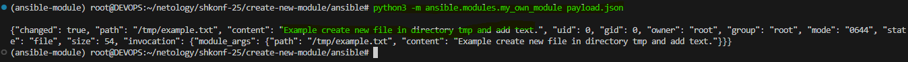
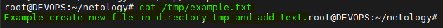
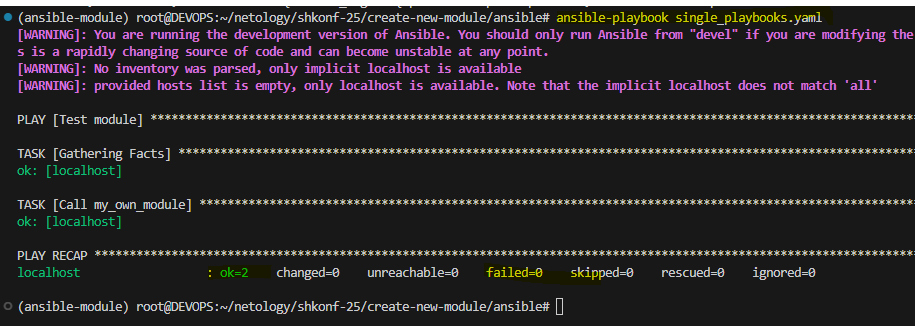
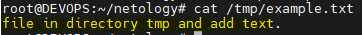
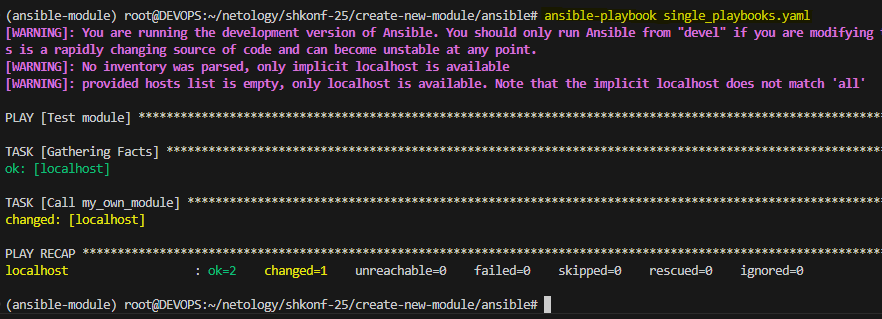
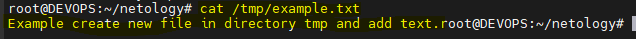

# Домашнее задание к занятию 6 «Создание собственных модулей» - Иванов Сергей

## Подготовка к выполнению

1. Создайте пустой публичный репозиторий в своём любом проекте: my_own_collection.
2. Скачайте репозиторий Ansible: `git clone https://github.com/ansible/ansible.git` по любому, удобному вам пути.
3. Зайдите в директорию Ansible: `cd ansible`.
4. Создайте виртуальное окружение: `python3 -m venv venv`.
5. Активируйте виртуальное окружение: `. venv/bin/activate`. Дальнейшие действия производятся только в виртуальном окружении.
6. Установите зависимости `pip install -r requirements.txt`.
7. Запустите настройку окружения `. hacking/env-setup`.
8. Если все шаги прошли успешно — выйдите из виртуального окружения `deactivate`.
9. Ваше окружение настроено. Чтобы запустить его, нужно находиться в директории `ansible` и выполнить конструкцию `. venv/bin/activate && . hacking/env-setup`.

## Основная часть

Ваша цель — написать собственный module, который вы можете использовать в своей role через playbook. Всё это должно быть собрано в виде collection и отправлено в ваш репозиторий.

**Шаг 1.** В виртуальном окружении создайте новый my_own_module.py файл.

**Шаг 2.** Наполните его содержимым:

```python
#!/usr/bin/python

# Copyright: (c) 2018, Terry Jones <terry.jones@example.org>
# GNU General Public License v3.0+ (see COPYING or https://www.gnu.org/licenses/gpl-3.0.txt)
from __future__ import (absolute_import, division, print_function)
__metaclass__ = type

DOCUMENTATION = r'''
---
module: my_test

short_description: This is my test module

# If this is part of a collection, you need to use semantic versioning,
# i.e. the version is of the form "2.5.0" and not "2.4".
version_added: "1.0.0"

description: This is my longer description explaining my test module.

options:
    name:
        description: This is the message to send to the test module.
        required: true
        type: str
    new:
        description:
            - Control to demo if the result of this module is changed or not.
            - Parameter description can be a list as well.
        required: false
        type: bool
# Specify this value according to your collection
# in format of namespace.collection.doc_fragment_name
extends_documentation_fragment:
    - my_namespace.my_collection.my_doc_fragment_name

author:
    - Your Name (@yourGitHubHandle)
'''

EXAMPLES = r'''
# Pass in a message
- name: Test with a message
  my_namespace.my_collection.my_test:
    name: hello world

# pass in a message and have changed true
- name: Test with a message and changed output
  my_namespace.my_collection.my_test:
    name: hello world
    new: true

# fail the module
- name: Test failure of the module
  my_namespace.my_collection.my_test:
    name: fail me
'''

RETURN = r'''
# These are examples of possible return values, and in general should use other names for return values.
original_message:
    description: The original name param that was passed in.
    type: str
    returned: always
    sample: 'hello world'
message:
    description: The output message that the test module generates.
    type: str
    returned: always
    sample: 'goodbye'
'''

from ansible.module_utils.basic import AnsibleModule


def run_module():
    # define available arguments/parameters a user can pass to the module
    module_args = dict(
        name=dict(type='str', required=True),
        new=dict(type='bool', required=False, default=False)
    )

    # seed the result dict in the object
    # we primarily care about changed and state
    # changed is if this module effectively modified the target
    # state will include any data that you want your module to pass back
    # for consumption, for example, in a subsequent task
    result = dict(
        changed=False,
        original_message='',
        message=''
    )

    # the AnsibleModule object will be our abstraction working with Ansible
    # this includes instantiation, a couple of common attr would be the
    # args/params passed to the execution, as well as if the module
    # supports check mode
    module = AnsibleModule(
        argument_spec=module_args,
        supports_check_mode=True
    )

    # if the user is working with this module in only check mode we do not
    # want to make any changes to the environment, just return the current
    # state with no modifications
    if module.check_mode:
        module.exit_json(**result)

    # manipulate or modify the state as needed (this is going to be the
    # part where your module will do what it needs to do)
    result['original_message'] = module.params['name']
    result['message'] = 'goodbye'

    # use whatever logic you need to determine whether or not this module
    # made any modifications to your target
    if module.params['new']:
        result['changed'] = True

    # during the execution of the module, if there is an exception or a
    # conditional state that effectively causes a failure, run
    # AnsibleModule.fail_json() to pass in the message and the result
    if module.params['name'] == 'fail me':
        module.fail_json(msg='You requested this to fail', **result)

    # in the event of a successful module execution, you will want to
    # simple AnsibleModule.exit_json(), passing the key/value results
    module.exit_json(**result)


def main():
    run_module()


if __name__ == '__main__':
    main()
```

Или возьмите это наполнение из статьи.

**Шаг 3.** Заполните файл в соответствии с требованиями Ansible так, чтобы он выполнял основную задачу: module должен создавать текстовый файл на удалённом хосте по пути, определённом в параметре path, с содержимым, определённым в параметре content.

**Шаг 4.** Проверьте module на исполняемость локально.

**Шаг 5.** Напишите single task playbook и используйте module в нём.

**Шаг 6.** Проверьте через playbook на идемпотентность.

**Шаг 7.** Выйдите из виртуального окружения.

**Шаг 8.** Инициализируйте новую collection: ansible-galaxy collection init my_own_namespace.yandex_cloud_elk.

**Шаг 9.** В эту collection перенесите свой module в соответствующую директорию.

**Шаг 10.** Single task playbook преобразуйте в single task role и перенесите в collection. У role должны быть default всех параметров module.

**Шаг 11.** Создайте playbook для использования этой role.

**Шаг 12.** Заполните всю документацию по collection, выложите в свой репозиторий, поставьте тег 1.0.0 на этот коммит.

**Шаг 13.** Создайте .tar.gz этой collection: ansible-galaxy collection build в корневой директории collection.

**Шаг 14.** Создайте ещё одну директорию любого наименования, перенесите туда single task playbook и архив c collection.

**Шаг 15.** Установите collection из локального архива: ansible-galaxy collection install <archivename>.tar.gz.

**Шаг 16.** Запустите playbook, убедитесь, что он работает.

**Шаг 17.** В ответ необходимо прислать ссылки на collection и tar.gz архив, а также скриншоты выполнения пунктов 4, 6, 15 и 16.

## Необязательная часть

1. Реализуйте свой модуль для создания хостов в Yandex Cloud.
2. Модуль может и должен иметь зависимость от yc, основной функционал: создание ВМ с нужным сайзингом на основе нужной ОС. Дополнительные модули по созданию кластеров ClickHouse, MySQL и прочего реализовывать не надо, достаточно простейшего создания ВМ.
3. Модуль может формировать динамическое inventory, но эта часть не является обязательной, достаточно, чтобы он делал хосты с указанной спецификацией в YAML.
4. Протестируйте модуль на идемпотентность, исполнимость. При успехе добавьте этот модуль в свою коллекцию.
5. Измените playbook так, чтобы он умел создавать инфраструктуру под inventory, а после устанавливал весь ваш стек Observability на нужные хосты и настраивал его.
6. В итоге ваша коллекция обязательно должна содержать: clickhouse-role (если есть своя), lighthouse-role, vector-role, два модуля: my_own_module и модуль управления Yandex Cloud хостами и playbook, который демонстрирует создание Observability стека.

## Как оформить решение задания
Выполненное домашнее задание пришлите в виде ссылки на .md-файл в вашем репозитории.

## Решение

### Шаг 1. Создание окружения сборки модуля

1. Создано виртуальное окружение как описано в разделе **Подготовка к выполнению** с одной лишь оговоркой, что окружение настроено с использованием PYENV.
Это детали и не влияют на результтат выполнения работ.

2. Загружен проект Ansible c удаленного репозитория: `git clone https://github.com/ansible/ansible.git`

## Шаг 2. Создание файла модуля

2.1 Создан файл по пути:  `ansible/lib/ansible/modules/my_own_module.py` и изменено содержимое функции `run_module()`:

```python
def run_module():
    import os
    module_args = dict(
        path=dict(type='str', required=True),
        content=dict(type='str', required=True)
    )

    result = dict(
        changed=False,
        path='',
        content=''
    )

    module = AnsibleModule(
        argument_spec=module_args,
        supports_check_mode=True
    )

    path = module.params['path']
    content = module.params['content']
    result['path'] = path
    result['content'] = content

    if module.check_mode:
        module.exit_json(**result)

    try:
        if not os.path.exists(path) or open(path).read() != content:
            with open(path, 'w') as f:
                f.write(content)
            result['changed'] = True
    except Exception as e:
        module.fail_json(msg=str(e), **result)

    module.exit_json(**result)
```

Где:
**path** - принимает путь к создаваемуму файлу;
**content** - Текстовое содержание которое должнро быть в файле

Создаем в ккорне реозиоория Ansible файл с параметрами запуска `payload.json`:

```yaml
{
    "ANSIBLE_MODULE_ARGS": {
        "path": "/tmp/example.txt",
        "content": "Пример создания файла в директории"
    }
}
```

## Шаг 3. Проверка module на исполняемость локально.

И запускаем созданный модуль командой:

```bash
python3 -m ansible.modules.my_own_module payload.json
```


Результат выполнения:




## Шаг 4. Создаем single task playbook и используем module в нём.
Создаем файл в корне директории ansible `single_playbooks.yaml`

```yaml
---
- name: Test module
  hosts: localhost
  tasks:
    - name: Call my_own_module
      my_own_module:
        path: /tmp/example.txt
        content: Example create new file in directory tmp and add text.
```

Запускаем плейбук `ansible-playbook single_playbooks.yaml `


Результат выполнения команды:



## Шаг 5. Проверка через playbook на идемпотентность.

Изменяем созданный файл

```bash

```
И удаляем часть слов, напрмер, исходный текст `Example create new file in directory tmp and add text.` изменяем в текст `file in directory tmp and add text.`


 
и запускаем заново плейбук как описано на шаге 4.

Резултьтат:



Наблюдаем, что состояние файла приведено к состоянию описанному в плейбуке



## Шаг 6. Инициализируем новую collection: ansible-galaxy collection init my_own_namespace.yandex_cloud_elk

```bash
ansible-galaxy collection init my_own_namespace.yandex_cloud_elk

mkdir my_own_namespace/yandex_cloud_elk/plugins/modules

mv lib/ansible/modules/my_own_module.py my_own_namespace/yandex_cloud_elk/plugins/modules/
```

## Шаг 6. Преобразование single task playbook в role

```bash
ansible-galaxy role init my_own_namespace/yandex_cloud_elk.roles.create_file
```

Переносим задачу из playbook в `my_own_namespace/yandex_cloud_elk.roles.create_file/tasks/main.yml`:
```yaml
- name: Create file with my module
  my_own_module:
    path: "{{ path }}"
    content: "{{ content }}"
```

В roles/create_file/defaults/main.yml указываем значения по умолчанию:

```yaml
path: "/tmp/example.txt"
content: "Example create new file in directory tmp and add text."
```
Теперь роль можно вызывать с параметрами или использовать defaults.

## Шаг 7. Playbook для использования роли

Создаtv `playbook_use_role.yml`:

```yaml
- hosts: localhost
  gather_facts: no
  roles:
    - role: my_own_namespace.yandex_cloud_elk.create_file
      vars:
        path: "/tmp/test_role_file.txt"
        content: "File create for role"
```

## Шаг 8. Документация и коммит

Описание создано в файле `my_own_namespace/yandex_cloud_elk/README.md`

Создаем коммит:

```bash
git add .
git commit -m "Add my_own_module, role and documentation"
git tag 1.2.0
git push origin main --tags
```