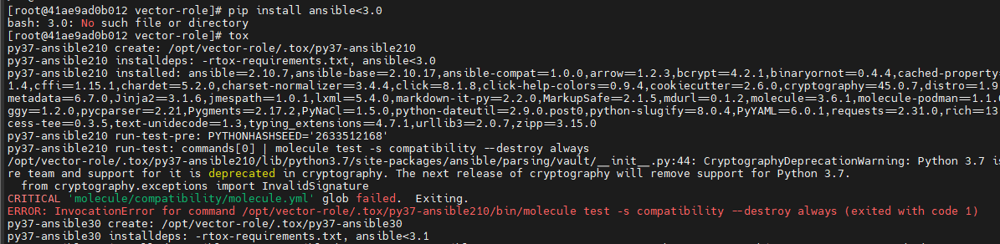
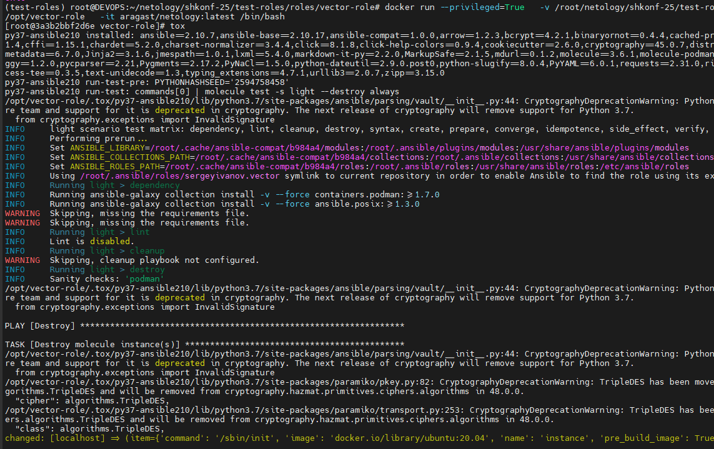

# Домашнее задание к занятию 5 «Тестирование roles» - Иванов Сергей
## Подготовка к выполнению
1. Установите molecule и его драйвера: pip3 install "molecule molecule_docker molecule_podman.
2. Выполните docker pull aragast/netology:latest — это образ с podman, tox и несколькими пайтонами (3.7 и 3.9) внутри.

## Основная часть
**Ваша цель** — настроить тестирование ваших ролей.
**Задача** — сделать сценарии тестирования для vector.
**Ожидаемый результат** — все сценарии успешно проходят тестирование ролей.

## Molecule
1. Запустите molecule test -s ubuntu_xenial (или с любым другим сценарием, не имеет значения) внутри корневой директории clickhouse-role, посмотрите на вывод команды. Данная команда может отработать с ошибками или не отработать вовсе, это нормально. Наша цель - посмотреть как другие в реальном мире используют молекулу И из чего может состоять сценарий тестирования.
2. Перейдите в каталог с ролью vector-role и создайте сценарий тестирования по умолчанию при помощи molecule init scenario --driver-name docker.
3. Добавьте несколько разных дистрибутивов (oraclelinux:8, ubuntu:latest) для инстансов и протестируйте роль, исправьте найденные ошибки, если они есть.
4. Добавьте несколько assert в verify.yml-файл для проверки работоспособности vector-role (проверка, что конфиг валидный, проверка успешности запуска и др.).
5. Запустите тестирование роли повторно и проверьте, что оно прошло успешно.
6. Добавьте новый тег на коммит с рабочим сценарием в соответствии с семантическим версионированием.

 ## Решение
Все действия я произвожу в виртуальном окружении **pyenv**. Установка и настройка **pyenv** в рамках ДЗ не описываются. 
Устанавливаем необходимые пакеты **molecule**

1. ## Clickhouse
```
pip install -r requirements-test.txt
```

Заходим в папку с ролью clickhouse

```
cd roles/clickhouse
```

Создаем сценарий molecule
```
molecule init scenario docker_scen
```

Выполнение тестирования с запись в лолг-файл **docker_scen.log** [Ссылка на лог-файл](../test-roles/logs/docker_scen.log)
```
molecule test -s docker_scen > docker_scen.log
```

2. ## Vector

Заходим в папку с ролью Vector

```
cd roles/vector-role
```

Создаем сценарий molecule
```
molecule init scenario --driver-name docker
```

Выполнение тестирования с запись в лолг-файл **default.log** [Ссылка на лог-файл](../test-roles/logs/default.log)
```
molecule test > default.log
```
## Прогон только одного дистрибутива (удобно)

Выполнение тестирования с запись в лолг-файл **docker_ubuntu.log** [Ссылка на лог-файл](../test-roles/logs/docker_ubuntu.log)
```
molecule converge -- --limit ubuntu > docker_ubuntu.log
```
или Выполнение тестирования с запись в лолг-файл **docker_oraclelinux.log** [Ссылка на лог-файл](../test-roles/logs/docker_oraclelinux.log)

```
molecule converge -- --limit oraclelinux > docker_oraclelinux.log
```

## Тегирование коммита

Для первого рабочего molecule-сценария идеально

```bash
v1.0.0
```
Последовательность команд

```bash
git status
git add .
git commit -m "Add molecule tests and verification for vector-role and clickhouse"
```

Добавляем тег:

```bash
git tag v1.0.0
git push origin main --tags
```

## Tox
1. Добавьте в директорию с vector-role файлы из директории.
2. Запустите docker run --privileged=True -v <path_to_repo>:/opt/vector-role -w /opt/vector-role -it aragast/netology:latest /bin/bash, где path_to_repo — путь до корня репозитория с vector-role на вашей файловой системе.
3. Внутри контейнера выполните команду tox, посмотрите на вывод.
4. Создайте облегчённый сценарий для molecule с драйвером molecule_podman. Проверьте его на исполнимость.
5. Пропишите правильную команду в tox.ini, чтобы запускался облегчённый сценарий.
6. Запустите команду tox. Убедитесь, что всё отработало успешно.
7. Добавьте новый тег на коммит с рабочим сценарием в соответствии с семантическим версионированием.
8. После выполнения у вас должно получится два сценария molecule и один tox.ini файл в репозитории. Не забудьте указать в ответе теги решений Tox и Molecule заданий. В качестве решения пришлите ссылку на ваш репозиторий и скриншоты этапов выполнения задания.

## Решение

Установим новые пакеты:

```bash
pip install -r tox-requirements.txt
```

Запуска сценария
```bash
docker run --privileged=True \
  -v /root/netology/shkonf-25/test-roles/roles/vector-role:/opt/vector-role \
  -w /opt/vector-role \
  -it aragast/netology:latest /bin/bash
```

* Первый прогон tox - ошибка из-за отсутствия сценария compatibility
* Создан облегчённый сценарий light



После исправления, на данном скриншоте мы видим что сценарий тестирования tox стал успешно выполнятся:



## Необязательная часть
1. Проделайте схожие манипуляции для создания роли LightHouse.
2. Создайте сценарий внутри любой из своих ролей, который умеет поднимать весь стек при помощи всех ролей.
3. Убедитесь в работоспособности своего стека. Создайте отдельный verify.yml, который будет проверять работоспособность интеграции всех инструментов между ними.
4. Выложите свои roles в репозитории.
В качестве решения пришлите ссылки и скриншоты этапов выполнения задания.

## Как оформить решение задания
Выполненное домашнее задание пришлите в виде ссылки на .md-файл в вашем репозитории.